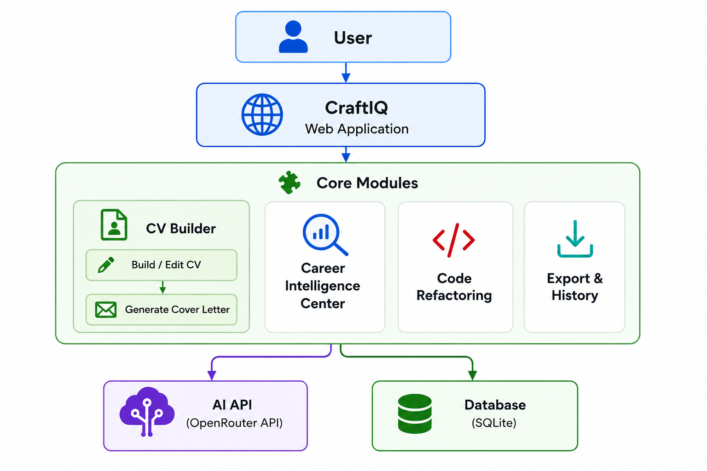

# CraftIQ

**An AI-powered career platform for building CVs, writing cover letters, analyzing job fit, and refactoring code.**

## Demo


https://github.com/user-attachments/assets/320ab1d5-c490-43f9-bc85-c0f550185f09


## Highlights

- Full-stack C# / ASP.NET Core MVC app with 8 AI analysis tools, 10 CV templates, and a C/C++ code refactoring tool
- Hybrid scoring: measurable CV metrics computed in code, so AI errors can't change objective scores
- Secure by design: per-user data isolation, rate limiting, and magic-byte upload validation
- 16 automated xUnit tests, including integration tests with an in-memory database

---

CraftIQ is a full-stack web application I designed and built in C# with ASP.NET Core MVC (.NET 8) during my M.S. in Computer Science at Seattle University. It brings the tools job seekers usually use separately into one place: a CV builder, a cover letter generator, a set of career analysis tools, and a code quality tool for C/C++ developers.



---

## The Problem

Job seekers often jump between many tools: one to write a CV, another to check it against applicant tracking systems (ATS), another to write cover letters, and another to prepare for interviews. Most AI resume tools also produce scores that change every time you run them, which makes them hard to trust.

CraftIQ addresses both problems. It keeps the full workflow in one application, and it makes analysis results reliable by computing everything measurable in code instead of asking the AI to guess.

---

## Features

| Feature | What it does |
|---------|-------------|
| **CV Builder** | Multi-step form that turns career details into a structured, ATS-friendly CV. Auto-saves progress and can import an existing CV from PDF, DOCX, or an image. |
| **10 CV Templates** | Live preview with inline editing, so users can fix any line without regenerating. Custom accent colors. |
| **Cover Letter Workspace** | 8 letter styles (Professional, Internship, Software Engineer, Academic, Startup, Career Change, Short & Direct, Modern Formal) with tone, length, and focus controls. |
| **Career Intelligence Center** | 8 analysis tools: ATS Analyzer, CV Health Dashboard, Job Match Scanner, Recruiter Simulation, Bullet Improver, Project Enhancer, Interview Question Generator, and LinkedIn Profile Generator. |
| **Code Refactor Tool** | Analyzes C/C++ code for 14 categories of code smells, rates each by severity with exact line numbers, and returns a cleaned-up version. |
| **Export** | CVs to PDF, DOCX, PNG, TXT, and JSON. Cover letters to PDF and DOCX. |
| **History** | All saved CVs and analysis reports in one place, ready to reopen. |

---

## Tech Stack

| Layer | Technologies |
|-------|-------------|
| Backend | C# 12, ASP.NET Core MVC (.NET 8), Kestrel |
| Data | Entity Framework Core 8, SQLite |
| AI | OpenRouter API (chat completions, plus a vision model for reading CV images) |
| Document processing | iText7 (PDF reading), DocumentFormat.OpenXml (DOCX), QuestPDF and Playwright (PDF generation) |
| Frontend | Razor views, vanilla JavaScript, CSS |
| Testing | xUnit, EF Core InMemory, coverlet |

---

## What I Developed

### Backend architecture
I structured the application in layers: controllers handle HTTP requests, services contain the business logic, and Entity Framework Core manages the database. Every service is defined by an interface (for example `ICVService` and `IAnalysisReportService`), which keeps the parts independent and makes them easy to test or replace.

The app exposes REST API endpoints across six controllers for CV generation, storage, analysis, reports, code refactoring, and downloads.

### Database
I designed a SQLite schema with three tables: `CVRecords` for saved CVs, `CVAutoSaves` for unsaved work, and `AnalysisReports` for saved analysis results. Every table is indexed by user, and every query filters by the signed-in user, so one user can never read or delete another user's data.

### Hybrid scoring system
This is the core design decision of the project. When a CV is analyzed, four scores (completeness, project depth, readability, and skills) are computed directly in C# from measurable facts such as section count, bullets per job, and summary length. Only subjective qualities like keyword strength and action verbs go to the AI.

The C# scores are sent to the AI as fixed values, then re-applied after the response arrives. This guarantees the measurable scores are always consistent and can never be changed by an AI mistake.

### Document extraction pipeline
Users can upload an existing CV in several formats. I built a pipeline that extracts text from PDFs with iText7, from Word files with OpenXml, and from images with a vision AI model. The AI then converts the raw text into structured data that fills in the CV form automatically.

### Export system
Exports first try a high-quality path: Playwright renders the exact live preview to PDF. If Playwright isn't available, the app falls back to QuestPDF. PNG, DOCX, and PDF exports also work fully in the browser.

---

## Challenges and How I Solved Them

**Inconsistent AI output.** The AI sometimes returned a single string where the code expected a list, or wrapped its JSON in Markdown code fences. I wrote a custom JSON converter (`FlexibleStringListConverter`) that accepts strings, lists, nulls, and numbers, and a parser that strips code fences before reading the response. AI responses no longer crash the app.

**Untrustworthy AI scores.** AI models can return different scores for the same input and sometimes state facts that aren't true. To keep results reliable, I designed the hybrid scoring system described above, where anything measurable is calculated in code.

**Upload security.** File extensions and content-type headers can be faked. I validated uploads by checking each file's first bytes (its "magic bytes") to confirm it really is a PDF or DOCX, capped upload size at 10 MB, and determined image types from the extension rather than the client-supplied header.

**Controlling AI cost and abuse.** I added rate limiting on all AI endpoints: 20 requests per minute per client, with excess requests rejected with HTTP 429.

**Accurate line numbers for code smells.** AI models often miscount lines. Before sending code for analysis, the app adds line numbers to every line, so reported code smells point to the right place.

**Template rendering issues.** Some characters, like em dashes, broke certain templates. I added rules to the generation prompts to avoid them.

---

## Testing

The project includes **16 automated tests** written with xUnit:

- **10 unit tests** for the scoring algorithms, covering empty CVs, complete CVs, and edge cases. A `[Theory]` test checks the skills score across several input ranges.
- **6 integration tests** for the report service, using an in-memory database. They cover saving, updating, listing, counting, and deleting reports, including a security test confirming that one user cannot delete another user's report.

Run them with:

```bash
dotnet test CraftIQ.Tests/CraftIQ.Tests.csproj
```

---

## Getting Started

**Prerequisites:** .NET 8 SDK and an [OpenRouter](https://openrouter.ai) API key.

```bash
git clone https://github.com/hopelad/CraftIQ.git
cd CraftIQ/CraftIQ
```

Store your configuration with user secrets (never commit real keys or passwords):

```bash
dotnet user-secrets init
dotnet user-secrets set "Groq:ApiKey" "your-openrouter-key"
dotnet user-secrets set "Auth:Username" "your-username"
dotnet user-secrets set "Auth:Password" "your-password"
```

Run the app:

```bash
dotnet run
```

The SQLite database is created automatically on first run. A health check is available at `/health`.

---

## What I Would Improve Next

- Replace `EnsureCreated()` with EF Core migrations so the database schema can change without losing data
- Support multiple user accounts with hashed passwords stored in the database
- Rename the `Groq*` service classes to match the OpenRouter provider the app now uses
- Containerize with Docker and add a CI pipeline that runs the tests on every push
- Deploy publicly with HTTPS-only cookies

---

## Documentation

Full technical documentation, including the API reference, data models, and scoring formulas, is in [CraftIQ_Documentation.md](CraftIQ_Documentation.md).

## Author

**Abdi Temesgen Terfasa**
M.S. Computer Science, Seattle University
